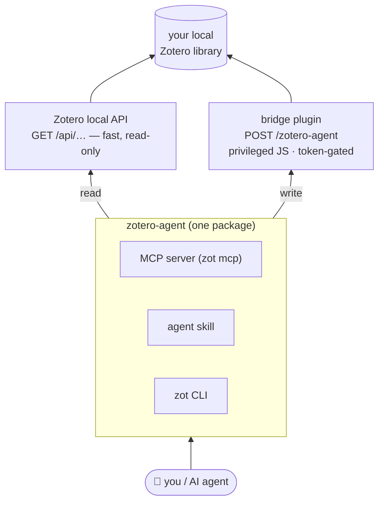

<h1 align="center">zotero-agent</h1>

<p align="center">
  <strong>Full local control of your Zotero library — from your terminal or your AI agent.</strong><br>
  No cloud, no account, no API key. Your library never leaves your machine.
</p>

<p align="center">
  <a href="https://pypi.org/project/zotero-agent/"></a>
  <a href="https://github.com/alex-roc/zotero-agent/actions/workflows/ci.yml"></a>
  
  
  <a href="https://alex-roc.github.io/zotero-agent/"></a>
</p>

`zot` gives you full **read-write** control of your *local* Zotero library:
search, bulk-edit metadata, tag, deduplicate, import by DOI/ISBN/arXiv, export,
enrich missing fields, and summarize PDFs into notes — scriptable from the shell
or drivable by an AI agent. It ships as a **CLI**, an **MCP server**, a **Claude
Code skill**, and portable **`AGENTS.md`** instructions.

<p align="center">
  
</p>

> **Why it's different.** Zotero's local HTTP API is *read-only*, so the popular
> tools (zotero-mcp, pyzotero) can only write through the zotero.org **web** API —
> which needs an account, an API key, and sync. zotero-agent writes **locally**
> through a tiny token-protected bridge plugin. Local, offline, private — and it
> finally does the [bulk metadata editing people have asked Zotero for since 2016](https://forums.zotero.org/discussion/111815/feature-batch-editing-metadata-for-multiple-items).
> See the honest [comparison](https://alex-roc.github.io/zotero-agent/compare/).



## Works with your agent

Anything that speaks **MCP** or can **run a shell command** can drive your library:

| Tool | How |
|------|-----|
| **Claude Code** | `zot skill install` (bundled skill), or `claude mcp add zotero-agent -- zot mcp` |
| **Claude Desktop** | add `zot mcp` to `claude_desktop_config.json` |
| **Codex CLI** | `~/.codex/config.toml` MCP entry, or `zot skill agents-md > AGENTS.md` and it calls `zot` |
| **Gemini CLI** | `~/.gemini/settings.json` MCP entry |
| **Cursor** | `.cursor/mcp.json` MCP entry |
| **OpenCode / Windsurf / any MCP client** | generic stdio server: `command: "zot", args: ["mcp"]` |
| **Local models / custom agents** | run the `zot` CLI directly (see `AGENTS.md`) — no MCP needed |

Per-client setup: [`docs/ai-agents.md`](docs/ai-agents.md) · [website](https://alex-roc.github.io/zotero-agent/ai-agents/mcp/).

## Install

```bash
# 1) the CLI (pick one)
uv tool install zotero-agent            # recommended
uv tool install "zotero-agent[mcp]"     # + the MCP server (zot mcp)
uv tool install "zotero-agent[mcp,toc]" # + PDF outlines (zot toc)
pipx install "zotero-agent[mcp]"
brew install alex-roc/tap/zotero-agent  # macOS/Linux; ships both extras

# 2) the bridge plugin in Zotero — download the XPI (this link is permanent):
#    https://github.com/alex-roc/zotero-agent/releases/latest/download/zotero-agent-bridge.xpi
#    Tools → Plugins → gear → "Install Plugin From File" → that .xpi
#    One-click, no restart. Zotero auto-updates it from then on.

# 3) wire it up
zot init      # generates a token, writes config, auto-detects your userID
zot ping      # local API up? bridge answering? plugin version? userID known?

# 4) optional: the Claude Code skill (bundled in the package)
zot skill install           # → ~/.claude/skills/zotero  (--project for one repo)
```

Updating: `uv tool upgrade zotero-agent` (or `brew upgrade zotero-agent`) for the
CLI; the plugin updates itself (Zotero polls the release manifest), and `zot ping`
shows both versions.

Requires **Zotero 7+** (tested through 9.x) running with the local API enabled
(the default), and **Python 3.10+**. Full guide: [`docs/install.md`](docs/install.md).

## Use it from the shell

```bash
zot search "bolivia" --limit 10               # fast local read
zot missing abstract --collection SS5MVVB6    # items lacking a field
zot stats                                     # library analytics
zot add doi 10.1371/journal.pmed.0020124 --pdf   # import + attach an OA PDF
zot dedupe --plan merges.jsonl                # review duplicates, then `zot merge --from`
zot enrich --field doi --dry-run              # fill missing DOIs, verified before writing
zot disk                                      # where the attachment store's gigabytes are
zot shrink --min-mb 25 --dry-run              # downsample oversized PDFs in place
zot apply edits.jsonl                         # declarative batch edit (undoable)
zot undo last                                 # roll it back
zot tag normalize --dry-run                   # fold case/space tag variants
zot export "My Collection" --format bibtex --out refs.bib
zot bib ABCD1234 @smith2020 --style apa       # formatted bibliography (Zotero key or citekey)
```

Every command takes `--json` for scripting. Writes refuse to run
non-interactively without `--yes`. Full reference: [`docs/commands.md`](docs/commands.md).

### Commands at a glance

| Group | Commands |
|-------|----------|
| **Read / analyze** | `search` `get` `cite` `pdf` `collections` `tags` `export` `missing` `author` `stats` `recent` `bib` `annotations` `related` `notes` `lint` |
| **Edit / organize** | `add` `dedupe` `merge` `tag` (add/rm/rename/purge/normalize/from-collections) `set` `move` `collection` `note` `attach` `pdf-fetch` |
| **Disk / cleanup** | `disk` `shrink` `gc` — `shrink` needs ghostscript + qpdf |
| **PDF outlines** | `toc` (show/scan/set/auto/clear) — needs the `[toc]` extra |
| **Scanned PDFs** | `pdf-prep` (split double pages, OCR) — needs `[toc]` + OCRmyPDF |
| **Batch (undoable)** | `apply` `undo` `enrich` |
| **Setup / escape** | `ping` `init` `skill` `backup` `sync` `restart` `exec` `mcp` `completion` |

### Batch edits are undoable

`zot apply` takes a JSONL script (one edit per line) and snapshots every touched
item first, so you can reverse it:

```jsonl
{"key":"ABCD1234","set":{"date":"2021"},"addTags":["review"]}
{"key":"@smith2020","addToCollection":"To Read","removeTags":["old"]}
```

```bash
zot apply edits.jsonl --dry-run   # preview (runs NO JS — cannot write)
zot apply edits.jsonl             # apply, snapshotting first
zot undo last                     # restore exactly the prior state
```

This is how agents do LLM-assisted cleanup safely: the model decides the values
and writes the JSONL; `zot` performs the writes. The CLI never calls an LLM itself.

### Give a PDF a real table of contents

Zotero's reader has an **Outline** tab, but it can only display bookmarks a PDF
already has — and most scanned books and reports have none. `zot toc` builds one
and writes it into the file, so the sidebar works in Zotero and everywhere else.

```bash
uv tool install --force "zotero-agent[toc]"   # the PDF engine is an extra
zot toc show ABCD1234                 # what the file already has
zot toc scan ABCD1234                 # what it could have, and from which evidence
zot toc auto ABCD1234 --dry-run       # build one deterministically, preview it
zot toc set  ABCD1234 --from toc.txt  # write your own (title<TAB>page, indented)
zot undo last                         # restore the previous outline
```

Detection prefers **the book's own contents page** over guessing from fonts —
those titles and that nesting are the publisher's. When the contents page prints
page numbers rather than linking, `zot toc` maps them onto physical pages using
`/PageLabels`, the folios printed on each page, and a title search to confirm
each row. That matters more than it sounds: front matter is numbered i, ii, iii
and the body restarts at 1, so a single offset is wrong for half the book.

Same loop from an agent: `zot toc scan --json` hands over the evidence, the model
decides the hierarchy, `zot toc set --from -` writes it. Writes are guarded by
`--yes`, previewable with `--dry-run`, and reversible with `zot undo`.

### Make a scanned book usable

A book scanned on a flatbed arrives as one landscape page per *pair* of printed
pages, with no text layer: you cannot search it, cite from it, or let an agent
read it, and it is several times larger than it needs to be. `zot pdf-prep` does
the whole pass — split, OCR, shrink — without the file leaving the item.

```bash
brew install ocrmypdf tesseract-lang unpaper jbig2enc   # apt: ocrmypdf tesseract-ocr-spa unpaper
zot pdf-prep @bowlesIntroduccionEconomia --dry-run   # what it sees, what it would do
zot pdf-prep @bowlesIntroduccionEconomia             # split + OCR, attached beside the original
zot pdf-prep --collection "Scans" --replace          # a whole shelf; trash each original
zot pdf-prep --collection "Scans" --prune            # or trash the originals later, once reviewed
```

A real example — Bowles, *Introducción a la economía*, 147 two-up pages at
200 dpi: **294 pages, 24.7 MB → 16.4 MB, searchable, in under three minutes.**

The split is the part that usually needs a human with [Briss], and the reason is
that the binding is never exactly centred. `pdf-prep` measures the ink profile of
sampled pages, takes the **median** of the ones with enough ink to be
informative, and applies that one cut to the whole book — the same decision a
human makes, for the same reason: on a near-blank page the "widest gap" is
anywhere, so a per-page cut eventually slices a chapter opening in half. Each
half keeps a sliver past the cut, so the ±2% a real binding wanders never clips a
letter. Pages that must stay whole (covers, fold-outs) are listed with `--single`.

Nothing is thrown away by default: the processed PDF is attached **beside** the
original and tagged `pdf-prep`, because OCR is a machine's judgement call and the
scan is often the only copy. `--replace` trashes the original as it goes;
`--prune` does it afterwards for items already processed, so a large library does
not quietly end up holding two copies of every book. Both use Zotero's trash, and
both **leave an annotated original alone**: Zotero anchors highlights to the
attachment and to page coordinates, so they cannot follow a file whose pages have
just been split apart (`--trash-annotated` overrides). Prepare a scan before you
read it and the question never comes up.

[Briss]: https://briss.sourceforge.net/

## Use it from an agent

Ask your agent things like *"tag every abstract-less item `#review` and merge
duplicate titles in collection X"*, *"fill in missing DOIs"*, or *"summarize this
paper's PDF chapter by chapter and save it as a note."* It drives `zot` and
follows a safe workflow (backup → sync-off → dry-run → small batch), and batch
edits stay undoable.

## Security

The bridge runs **arbitrary privileged JavaScript** inside Zotero — deliberately,
because it's the only complete local write path. It's gated by a required token,
a browser-origin/CSRF guard, loopback-only binding, and an append-only audit log.
This is a real capability: read [`docs/security.md`](docs/security.md) before
installing. Report issues privately via [`SECURITY.md`](SECURITY.md).

## Documentation

- **Website:** https://alex-roc.github.io/zotero-agent/ (quickstarts, cookbook, reference)
- [`docs/install.md`](docs/install.md) · [`docs/ai-agents.md`](docs/ai-agents.md) · [`docs/security.md`](docs/security.md) · [`docs/architecture.md`](docs/architecture.md) · [`docs/commands.md`](docs/commands.md)
- JS recipe book: [`skill/references/recipes.md`](skill/references/recipes.md)

## Contributing / development

```bash
git clone https://github.com/alex-roc/zotero-agent.git && cd zotero-agent
./install.sh                            # dev shim on PATH + skill (symlinked) + XPI + zot init
python3 -m unittest discover -s tests   # tests: fake Zotero server, no network
uvx ruff check src tests cli/zot scripts
uv build                                # wheel + sdist
bash plugin/build.sh                    # rebuild the bridge XPI
```

The core is **stdlib-only**; the optional surfaces ride behind extras (`[mcp]`
for the MCP server, `[toc]` for the PDF outline commands).
See [`CONTRIBUTING.md`](CONTRIBUTING.md) and [`CHANGELOG.md`](CHANGELOG.md).
License: [AGPL-3.0-or-later](LICENSE).
