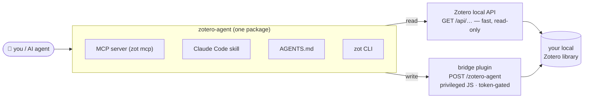

<h1 align="center">zotero-agent</h1>

<p align="center">
  <strong>Full local control of your Zotero library — from your terminal or your AI agent.</strong><br>
  No cloud, no account, no API key. Your library never leaves your machine.
</p>

<p align="center">
  <a href="https://pypi.org/project/zotero-agent/"></a>
  <a href="https://github.com/alex-roc/zotero-agent/actions/workflows/ci.yml"></a>
  
  
  <a href="https://alex-roc.github.io/zotero-agent/"></a>
</p>

`zot` gives you full **read-write** control of your *local* Zotero library:
search, bulk-edit metadata, tag, deduplicate, import by DOI/ISBN/arXiv, export,
enrich missing fields, and summarize PDFs into notes — scriptable from the shell
or drivable by an AI agent. It ships as a **CLI**, an **MCP server**, a **Claude
Code skill**, and portable **`AGENTS.md`** instructions.

> **Why it's different.** Zotero's local HTTP API is *read-only*, so the popular
> tools (zotero-mcp, pyzotero) can only write through the zotero.org **web** API —
> which needs an account, an API key, and sync. zotero-agent writes **locally**
> through a tiny token-protected bridge plugin. Local, offline, private — and it
> finally does the [bulk metadata editing people have asked Zotero for since 2016](https://forums.zotero.org/discussion/111815/feature-batch-editing-metadata-for-multiple-items).
> See the honest [comparison](https://alex-roc.github.io/zotero-agent/compare/).



## Works with your agent

Anything that speaks **MCP** or can **run a shell command** can drive your library:

| Tool | How |
|------|-----|
| **Claude Code** | the bundled `zotero` skill, or `claude mcp add zotero-agent -- zot mcp` |
| **Claude Desktop** | add `zot mcp` to `claude_desktop_config.json` |
| **Codex CLI** | `~/.codex/config.toml` MCP entry, or it reads `AGENTS.md` and calls `zot` |
| **Gemini CLI** | `~/.gemini/settings.json` MCP entry |
| **Cursor** | `.cursor/mcp.json` MCP entry |
| **OpenCode / Windsurf / any MCP client** | generic stdio server: `command: "zot", args: ["mcp"]` |
| **Local models / custom agents** | run the `zot` CLI directly (see `AGENTS.md`) — no MCP needed |

Per-client setup: [`docs/ai-agents.md`](docs/ai-agents.md) · [website](https://alex-roc.github.io/zotero-agent/ai-agents/mcp/).

## Install

```bash
# 1) the CLI (pick one)
uv tool install zotero-agent            # recommended
uv tool install "zotero-agent[mcp]"     # + the MCP server (zot mcp)
pipx install "zotero-agent[mcp]"
brew install alex-roc/tap/zotero-agent

# 2) the bridge plugin in Zotero (one-click, no restart):
#    Tools → Plugins → gear → "Install Plugin From File" → the .xpi from Releases:
#    https://github.com/alex-roc/zotero-agent/releases/latest

# 3) wire it up
zot init      # generates a token, writes config, auto-detects your userID
zot ping      # local API up? bridge answering? userID known?
```

Requires **Zotero 7+** (tested through 9.x) running with the local API enabled
(the default), and **Python 3.9+**. Full guide: [`docs/install.md`](docs/install.md).

## Use it from the shell

```bash
zot search "bolivia" --limit 10               # fast local read
zot missing abstract --collection SS5MVVB6    # items lacking a field
zot stats                                     # library analytics
zot add doi 10.1371/journal.pmed.0020124 --pdf   # import + attach an OA PDF
zot dedupe --by title --fuzzy                 # find near-duplicate titles
zot enrich --field doi --dry-run              # fill missing DOIs from Crossref
zot apply edits.jsonl                         # declarative batch edit (undoable)
zot undo last                                 # roll it back
zot tag normalize --dry-run                   # fold case/space tag variants
zot export "My Collection" --format bibtex --out refs.bib
zot bib ABCD1234 @smith2020 --style apa       # formatted bibliography (Zotero key or citekey)
```

Every command takes `--json` for scripting. Writes refuse to run
non-interactively without `--yes`. Full reference: [`docs/commands.md`](docs/commands.md).

### Commands at a glance

| Group | Commands |
|-------|----------|
| **Read / analyze** | `search` `get` `cite` `pdf` `collections` `tags` `export` `missing` `author` `stats` `recent` `bib` `annotations` `related` `notes` `lint` |
| **Edit / organize** | `add` `dedupe` `tag` (add/rm/rename/purge/normalize) `set` `move` `collection` `note` |
| **Batch (undoable)** | `apply` `undo` `enrich` |
| **Setup / escape** | `ping` `init` `backup` `sync` `exec` `mcp` |

### Batch edits are undoable

`zot apply` takes a JSONL script (one edit per line) and snapshots every touched
item first, so you can reverse it:

```jsonl
{"key":"ABCD1234","set":{"date":"2021"},"addTags":["review"]}
{"key":"@smith2020","addToCollection":"To Read","removeTags":["old"]}
```

```bash
zot apply edits.jsonl --dry-run   # preview (runs NO JS — cannot write)
zot apply edits.jsonl             # apply, snapshotting first
zot undo last                     # restore exactly the prior state
```

This is how agents do LLM-assisted cleanup safely: the model decides the values
and writes the JSONL; `zot` performs the writes. The CLI never calls an LLM itself.

## Use it from an agent

Ask your agent things like *"tag every abstract-less item `#review` and merge
duplicate titles in collection X"*, *"fill in missing DOIs"*, or *"summarize this
paper's PDF chapter by chapter and save it as a note."* It drives `zot` and
follows a safe workflow (backup → sync-off → dry-run → small batch), and batch
edits stay undoable.

## Security

The bridge runs **arbitrary privileged JavaScript** inside Zotero — deliberately,
because it's the only complete local write path. It's gated by a required token,
a browser-origin/CSRF guard, loopback-only binding, and an append-only audit log.
This is a real capability: read [`docs/security.md`](docs/security.md) before
installing. Report issues privately via [`SECURITY.md`](SECURITY.md).

## Documentation

- **Website:** https://alex-roc.github.io/zotero-agent/ (quickstarts, cookbook, reference)
- [`docs/install.md`](docs/install.md) · [`docs/ai-agents.md`](docs/ai-agents.md) · [`docs/security.md`](docs/security.md) · [`docs/architecture.md`](docs/architecture.md) · [`docs/commands.md`](docs/commands.md)
- JS recipe book: [`skill/references/recipes.md`](skill/references/recipes.md)

## Contributing / development

```bash
git clone https://github.com/alex-roc/zotero-agent.git && cd zotero-agent
./install.sh                            # dev shim on PATH + skill + XPI + zot init
python3 -m unittest discover -s tests   # tests: fake Zotero server, no network
uvx ruff check src tests cli/zot scripts
uv build                                # wheel + sdist
bash plugin/build.sh                    # rebuild the bridge XPI
```

The core is **stdlib-only** (the MCP server is the sole optional dependency).
See [`CONTRIBUTING.md`](CONTRIBUTING.md) and [`CHANGELOG.md`](CHANGELOG.md).
License: [MIT](LICENSE).
