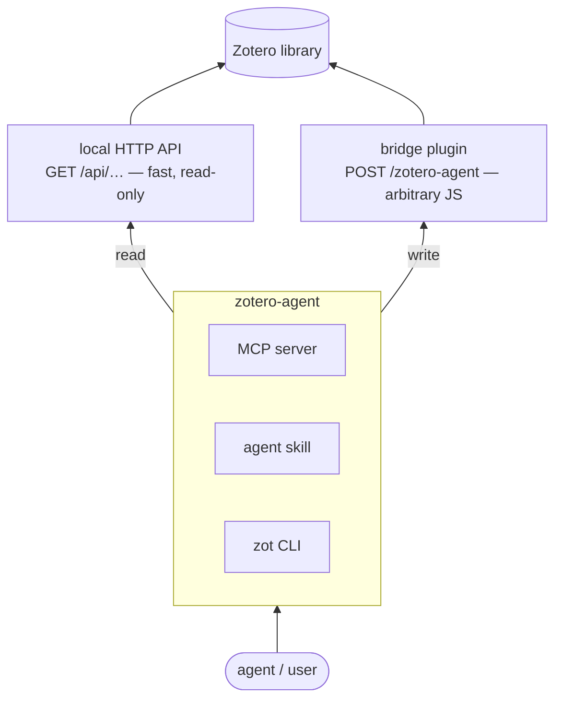

# Architecture

Three layers, each doing the one thing it is good at.

## Why the write path is a plugin

Zotero ships a **local HTTP API** at `http://localhost:23119/api/…` that mirrors
the Web API. On Zotero 7 / 9.x it is **read-only by design**: `POST /items` or
`POST /collections` returns `400 "Endpoint does not support method"`, and there
is no preference to enable writing. So the API is perfect for fast reads and
useless for writes.

Other options were evaluated and rejected:

- **Better BibTeX JSON-RPC** is alive but writes almost nothing (only
  `autoexport.add`, `collection.scanAUX`). Fine for search/export, not for
  editing the library.
- **The BBT debug-bridge** that older automation relied on **no longer exists**
  in current Better BibTeX (9.x).

The only complete *local* write path is code running **inside** Zotero's
privileged context, calling `Zotero.Item…saveTx()` and friends directly. That
is exactly what a bootstrap plugin can do. The bridge is a ~200-line plugin
that registers one endpoint, `POST /zotero-agent`, which runs a supplied async JS
body in-process and returns the result as JSON. This mirrors the well-known
`zotero-api-endpoint` plugin pattern.

## The layers

- **Layer 0 — the bridge plugin** (`plugin/zotero-agent-bridge/`): the endpoint.
  Token-protected, origin-guarded, loopback-only, audit-logged. Fully general —
  every recipe in the reference book works over it unchanged.
- **Layer 1 — the `zotero_agent` package** (`src/zotero_agent/`, entry point
  `zot`): stdlib-only core. `http`/`resolve` handle the fast read API and the
  bridge; `jslib` centralises the generated JS (so the collection resolver and
  "all regular items" scope exist once); `commands/{read,write,admin,features,toc}`
  hold the subcommands; each write is safe-by-default (refuses non-interactive
  runs without `--yes`). Batch edits (`apply`) snapshot first so `undo` can
  restore them. Config precedence: flags > `ZOTERO_AGENT_*` env >
  `~/.config/zotero-agent/config.json`.
- **Layer 1b — the PDF engine** (`src/zotero_agent/pdf/`): the only part that
  opens a file rather than talking to Zotero, behind the `[toc]` extra. PyMuPDF
  is reached solely through `require_pymupdf()`, so the rest of the package stays
  importable without it. Inside, `pagemap` is deliberately pure — the
  printed-page-to-physical-page arithmetic is the subtle part, and keeping it
  free of the engine is what makes it testable without a fixture PDF — while
  `scan` reads a document and `outline` reads, validates and writes the tree.
- **Layer 2a — the `zotero` skill** (`skill/`): teaches Claude Code to drive
  `zot`, including the safe workflow for bulk/destructive operations.
- **Layer 2b — the MCP server** (`zot mcp`, `src/zotero_agent/mcp_server.py`):
  exposes ~21 high-level tools to any MCP client. Each tool **reuses the CLI
  command functions** (with `--json`), so behaviour never diverges between the
  two surfaces. Optional `[mcp]` extra; `run_javascript` only with `--allow-exec`.

## Anti-duplication

The canonical sources live once. The generated JS lives in `jslib` (not copied
per command); the MCP tools call the same command functions the CLI does; the
recipe book (`skill/references/recipes.md`) is linked, not restated.

Each surface has exactly one distribution route, and one version covers them all:
the CLI, the MCP server and the skill ship in the **PyPI package** (`zot skill
install` unpacks the skill; `cli/zot` is the dev shim), while the plugin XPI ships
**only** as a GitHub Release asset. Zotero then keeps it current from
`updates.json`, which the release workflow generates from the tag —
`scripts/build_xpi.py` stamps the package version into the plugin, so a released
XPI can never disagree with the CLI it answers, and `zot ping` reports both.
